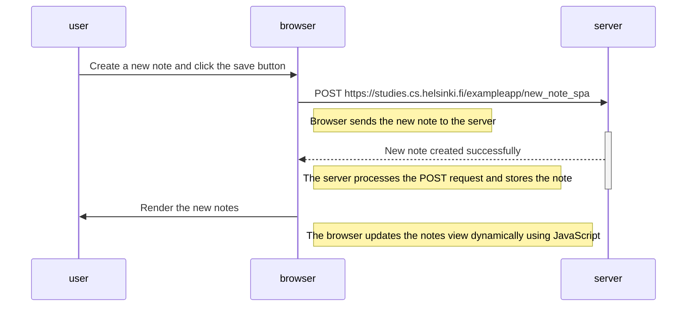

```mermaid
sequenceDiagram
    participant user
    participant browser
    participant server

    user->>browser: Create a new note and click the save button
    browser->>server: POST https://studies.cs.helsinki.fi/exampleapp/new_note_spa

    Note right of browser: Browser sends the new note to the server

    activate server

    server-->>browser: New note created successfully
    Note right of browser: The server processes the POST request and stores the note

    deactivate server

    browser->>user: Render the new notes 

    Note right of browser: The browser updates the notes view dynamically using JavaScript

```
